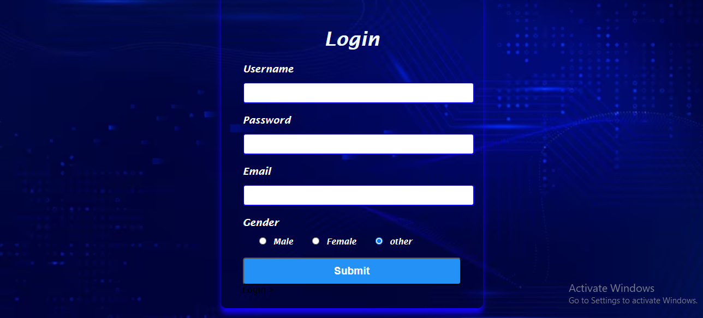

# Login Page

This is my first frontend project — a basic login form using HTML and CSS.

## 🔗 Live Site
[Click here to view it](https://saweraasad.github.io/login-page/)

## 🧰 Technologies
- HTML5
- CSS3

## 🎯 Learning Goal
To understand form structure, styling, and visual layout with pure HTML and CSS.
)
